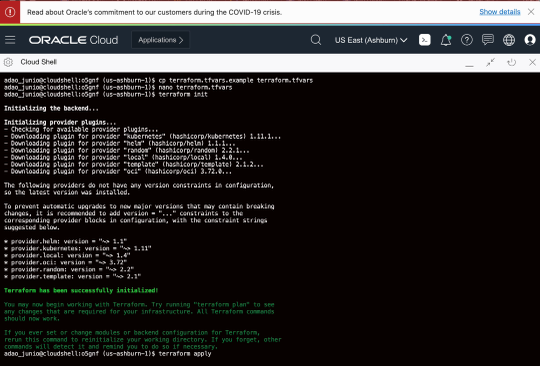

# Oracle 5G Aware terraform scripts

Deploys the whole solution in 15 minutes or less. Including OKE Cluster, Node Pools, Common Services to Kubernetes and the NRF and SCP (More to come)

## 

<!-- ##   -->

---

## Steps (Using Terraform and OCI CloudShell)
###### (If not using OCI CloudShell, you need to have the terraform, OCI cli and kubectl installed and configured on workstation that will be used)

1. Create a folder for the Terraform scripts: e.g.: `mkdir o5gnf && cd o5gnf`
1. Get the project: `wget https://objectstorage.us-ashburn-1.oraclecloud.com/p/opCk0GadynldE0TRNZwJl-zk4xECixWUA6m4a3II1QA/n/ociateam/b/repo/o/O5G-v100.zip`
1. Unzip. e.g.: `unzip O5G-v100.zip`
1. Copy the file `terraform.tfvars.example` to `terraform.tfvars` and update the tenancy_ocid and compartment_ocid variables `cp terraform.tfvars.example terraform.tfvars`
1. Run the command `terraform init` to init the Terraform and providers
1. Run the command `terraform apply` to deploy everything.
    * Takes near 8 min for the OKE cluster be deployed
    * Takes near 5 min to run the app deployment scripts, after the OKE cluster is ready

[Video: Oracle 5G NFs v1 - Deploying using CloudShell and Terraform](https://otube.oracle.com/media/t/0_4a2rcsny)

## Steps (Using OCI Console UI and Resource Manager)

1. Download the stack from here: [O5G-v100.zip](https://objectstorage.us-ashburn-1.oraclecloud.com/p/opCk0GadynldE0TRNZwJl-zk4xECixWUA6m4a3II1QA/n/ociateam/b/repo/o/O5G-v100.zip)
1. Open the Resource Manager on the OCI Console. e.g.: https://console.us-ashburn-1.oraclecloud.com/resourcemanager/stacks/create
1. Drag-and-Drop the O5G-v100.zip, optionally set any variables needed and click Create
1. Select "Terraform Apply"
    * Takes near 8 min for the OKE cluster be deployed
    * Takes near 5 min to run the app deployment scripts, after the OKE cluster is ready

## Accessing the new OKE cluster created
1. Go to the project folder (e.g.: cd cloud.poc.tf.oracle5gaware)
1. Run the command `export KUBECONFIG=./generated/kubeconfig` to use the kubeconfig for the created cluster
1. Run the command `kubectl get pods --all-namespaces` to to see all the pods created

## Accessing the Dashboards (Grafana)
1. Run the command `kubectl get svc -n occne-infra o5g-utils-nginx-ingress-controller` to get the EXTERNAL-IP of the ingress controller.
1. Run the command `kubectl get secret -n occne-infra o5g-utils-grafana -o jsonpath="{.data.admin-password}" | base64 --decode ; echo` to get the auto-generated grafana *admin* password.
1. Open the browser and point to <EXTERNAL_IP> to open the landing page.
1. Alternatively, you can go direct to <EXTERNAL_IP>/dashboards for the grafana dashboards.

## Accessing the logs (Kibana)
1. Run the command `kubectl get svc -n occne-infra o5g-efk-kibana-logging` to get the EXTERNAL-IP of the kibana loadbalancer.
1. Open the browser and point to <EXTERNAL_IP> to open the kibana ui.

---
# Release Notes:

## v100:
- Support for the vegeta load test
- Changed to Public nodes (Not recommended) to allow vegeta load test be called externally
- Opened node port for vegeta
- Introduction of the landing page service (Alpha)
- Use of NGINX Ingress controller to access grafana and jaeger UI (Kibana still creating it's own LoadBalancer as originally defined)
- Granafa updated to the version 6.7.1 to solve security issues
#### v100 Issues:
- `terraform destroy` does not remove loadbalancers created by NFs charts. Is needed to manually remove the loadbalancers. If the terraform destroy shows an error, manually delete the LBs and run `terraform destroy` again. Issue fixed on the v2
- `ocnrf-endpoint` service crashing sometimes, affecting the vegeta load test

## v001:
- Basic Terraform scripts to create OKE cluster with Private nodes, VCN, Subnets, Nat Gateway, Internet Gateway.
- Terraform script to include the Deployer to deploy the solution with NRF, SCP with provided values

---
# Roadmap

## v2 Roadmap:
- Grafana, Jaeger and Kibana using the same ingress controller (Using just one Loadbalancer)
- Change the EFK package to more modern and production-like package
- Change back to Private nodes
- Introduction of Locust service for load test, accessible from the landing page.
- Removal of the deployer
- Easy inclusion of new NFs to the auto-deployment scripts
- Graceful `terraform destroy`
- Change the load test from `vegeta` to `locust`

